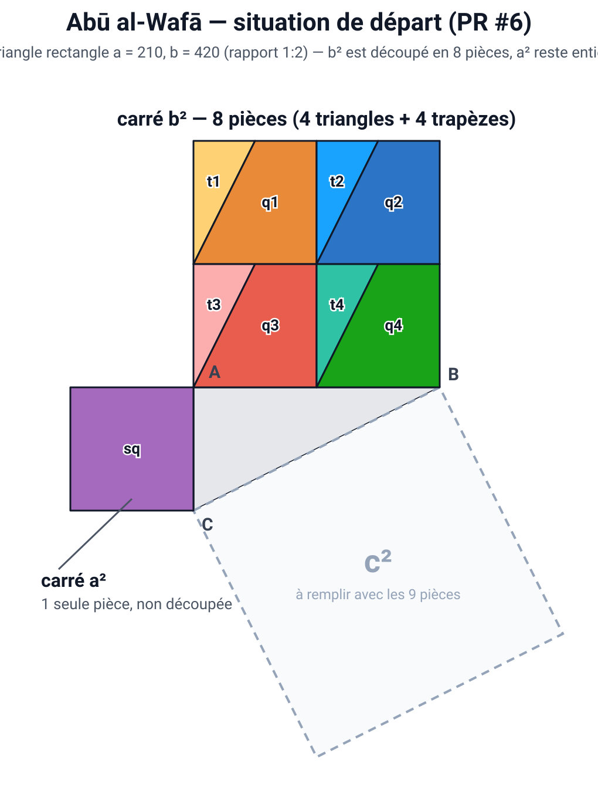
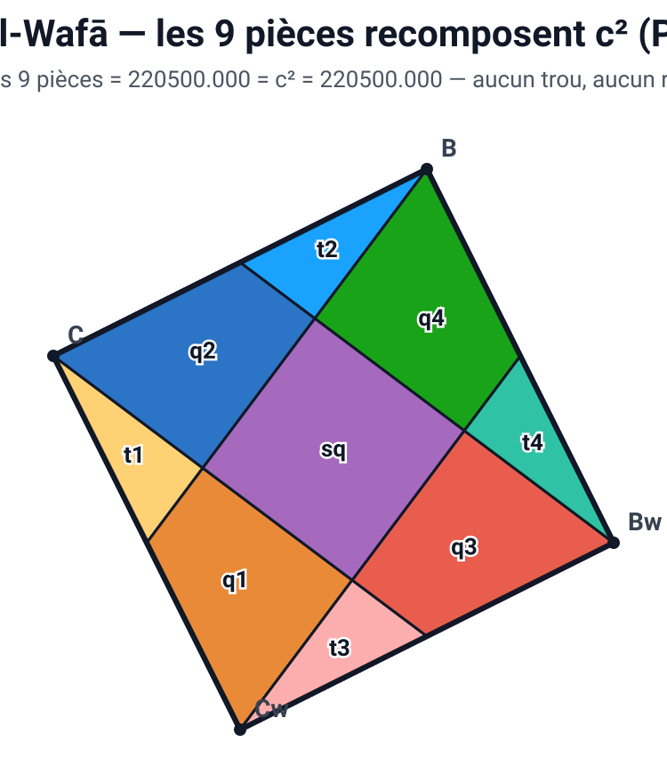

# La dissection d'Abū al-Wafā — dossier de reprise

**Statut : en attente, non intégrée.** Ce document existe pour qu'on puisse ajouter ce
puzzle au Moulin de Pythagore plus tard sans avoir à retrouver quoi que ce soit ailleurs.
Tout ce qui est nécessaire est ici : l'explication pédagogique, la preuve, le code complet
et la marche à suivre.

**Le fichier `outils/plateaux_manipulation/moulin_pythagore.html` n'a pas été modifié**
et ne doit pas l'être à l'occasion de la lecture de ce document. Il fonctionne, il a été
corrigé à la main, et nous n'avons pas de moyen de le tester automatiquement.

---

## 1. De quoi s'agit-il, et pourquoi c'est intéressant

Abū al-Wafā al-Būzjānī (940–998) est un mathématicien et astronome persan. On lui doit une
série de découpages géométriques élégants, dont celui-ci, qui démontre le théorème de
Pythagore : on découpe les carrés construits sur les deux côtés de l'angle droit, et on
recompose les morceaux pour remplir exactement le carré de l'hypoténuse.

Ce qui rend celui-ci intéressant en classe :

- **Le carré `a²` n'est pas découpé du tout.** Il traverse la manipulation en une seule
  pièce, entière. C'est le point pédagogique central : l'élève voit littéralement le
  « + a² » venir se poser au milieu du carré `c²`. L'égalité `c² = a² + b²` n'est pas une
  formule à croire, c'est un geste : je pose `a²`, je remplis le tour avec `b²`.
- **Seul `b²` est découpé, et de façon très lisible.** On divise `b²` en 4 cases carrées
  identiques, et on tire **un seul trait** dans chacune. Un trait par case, quatre traits
  en tout. C'est le découpage le plus simple à expliquer à voix haute de tous ceux du
  Moulin : « je coupe chaque case en deux, d'un coin au milieu du côté ».
- **Le résultat est une couronne.** Les 8 morceaux de `b²` viennent former un anneau
  autour du carré `a²` posé au centre. La figure finale se lit d'un coup d'œil.

### En quoi ça diffère de Périgal

| | Périgal | Abū al-Wafā |
|---|---|---|
| Nombre de pièces | 5 | 9 |
| Le carré `a²` | entier (1 pièce) | entier (1 pièce) |
| Le carré `b²` | découpé en 4 | découpé en 8 |
| Position de `a²` dans `c²` | décalée, en biais | **au centre exact** |
| Le découpage de `b²` | 2 traits obliques qui se croisent au centre | 4 traits, un par quart |

Périgal est plus économique (5 pièces contre 9) et c'est pour ça qu'il est le puzzle n° 1
de l'outil. Mais son découpage demande de tracer deux droites parallèles aux côtés du
triangle, ce qui est difficile à justifier devant une classe sans passer par le calcul.
Chez Abū al-Wafā, le découpage de `b²` se décrit en une phrase, et surtout **le carré `a²`
atterrit pile au centre de `c²`** : c'est beaucoup plus parlant visuellement. Périgal
apprend l'efficacité, Abū al-Wafā apprend la lecture de l'égalité.

---

## 2. La contrainte à connaître avant toute chose

> **Ce découpage ne fonctionne que pour le rapport 1:2, c'est-à-dire `b = 2a`.**

Ce n'est pas une limite de notre implémentation, c'est la nature même de la construction :
elle repose sur le fait que `c² = a² + b² = a² + 4a² = 5a²`, donc que le carré de
l'hypoténuse vaut exactement 5 petits carrés `a²`. Le découpage en 4 cases avec un trait
par case ne tombe juste que dans ce cas.

C'est le rapport par défaut du Moulin (`BASE = { b: 420, ratio: 0.5 }`), donc en pratique
ça ne pose pas de problème. Mais si un jour le curseur de rapport devient réglable pour
tous les puzzles, **celui-ci doit être verrouillé sur 1:2**, comme le sont déjà les
puzzles symétriques verrouillés sur 1:1. Ne pas le faire donnerait des pièces qui ne
pavent plus le carré, sans message d'erreur.

---

## 3. La preuve, avec les chiffres

Le triangle rectangle a pour côtés `a` et `b = 2a`. Donc :

```
c² = a² + b² = a² + (2a)² = a² + 4a² = 5a²
```

Il faut donc que les 9 pièces totalisent `5a²`. Voici leur compte :

| Pièces | Combien | Aire de chacune | Sous-total |
|---|---|---|---|
| Triangles (`t1`…`t4`) | 4 | `a²/4` | `a²` |
| Trapèzes (`q1`…`q4`) | 4 | `3a²/4` | `3a²` |
| Le carré non découpé (`sq`) | 1 | `a²` | `a²` |
| | | **Total** | **`5a²` = `c²`** |

Le détail : le carré `b²` est découpé en 4 cases de côté `a` (donc d'aire `a²` chacune,
`4a²` en tout). Dans chaque case, un trait va du coin haut-gauche au milieu du bord
supérieur, puis descend au coin bas-gauche — il détache un triangle d'aire `a²/4` et
laisse un trapèze d'aire `3a²/4`. On a bien `a²/4 + 3a²/4 = a²` par case, et `4 × a² = 4a²`
pour tout `b²`. On ajoute le carré `a²` intact et on obtient `5a² = c²`.

### Vérifications déjà faites

Le code ci-dessous a été exécuté et contrôlé numériquement (avec `a = 210`, `b = 420`,
donc `c² = 220 500`). Résultats :

- **Aires** : les 9 pièces totalisent exactement `220 500`, soit `c²`. Écart résiduel
  `5,8 × 10⁻¹¹` (arrondi machine). Réparties bien en `4 × 0,25 a²`, `4 × 0,75 a²`, `1 × 1 a²`.
- **Pavage à 100 %** : sur 88 712 points testés à l'intérieur du carré `c²`, **88 712 sont
  couverts par exactement une pièce**. Zéro trou, zéro recouvrement.
- **9 pièces congruentes** : chaque pièce de la position de départ est superposable à la
  pièce correspondante de la solution (même aire, mêmes longueurs de côtés, au 10⁻⁹ près).
  Les triangles mesurent 105 / 210 / 234,79 ; les trapèzes 105 / 210 / 210 / 234,79 ; le
  carré 210 × 4.
- **Aucun sommet hors cadre** : aucun des sommets des 9 pièces placées ne dépasse du carré
  `c²`.

### Aperçus

Position de départ — `b²` en haut découpé en 8, `a²` entier à gauche, `c²` vide à remplir :



Solution — les 9 pièces pavent `c²`, avec le carré `a²` (violet) au centre :



---

## 4. Le code complet, prêt à copier

Les deux fonctions ci-dessous sont reprises fidèlement de la PR #6. Elles s'appuient sur
les constantes déjà présentes dans `moulin_pythagore.html` (`COLORS`, `BASE`) et sur
l'objet « moulin » que l'outil construit déjà (`buildMoulin`, qui fournit `mold.a`,
`mold.uvec`, `mold.vvec` et le point `C`).

### 4.1 Les positions de départ — `generate()`

À insérer comme une entrée du dictionnaire `PUZZLES`. La signature
`generate(Ax, Ay, b, ratio)` est celle de tous les autres puzzles de l'outil.

Ce que fait le code : il parcourt les 4 cases de `b²` (2 lignes × 2 colonnes, chaque case
de côté `a`), et pour chacune il pose un triangle `TL–TM–BL` et un trapèze `TM–TR–BR–BL`,
où `TM` est le milieu du bord supérieur de la case. Puis il ajoute le carré `a²` en une
seule pièce, à gauche du sommet `A`.

```js
abuAlWafa: {
  name: "Abū al-Wafā",
  generate: (Ax, Ay, b, ratio) => {
    const a = b * ratio;
    const colors = [
      [COLORS.yellow,   COLORS.orange],
      [COLORS.blue,     COLORS.darkblue],
      [COLORS.lightRed, COLORS.red],
      [COLORS.teal,     COLORS.green]
    ];
    const pieces = [];
    let index = 0;
    for (let row = 0; row < 2; row++) {
      for (let col = 0; col < 2; col++) {
        const x = Ax + col * a, y = Ay - b + row * a;
        const TL = { x,         y };
        const TM = { x: x + a/2, y };
        const TR = { x: x + a,   y };
        const BL = { x,         y: y + a };
        const BR = { x: x + a,   y: y + a };
        index++;
        pieces.push(
          { key: `t${index}`, fill: colors[index-1][0], points: [TL, TM, BL] },
          { key: `q${index}`, fill: colors[index-1][1], points: [TM, TR, BR, BL] }
        );
      }
    }
    pieces.push({
      key: "sq", fill: COLORS.purple,
      points: [
        { x: Ax - a, y: Ay     }, { x: Ax, y: Ay     },
        { x: Ax,     y: Ay + a }, { x: Ax - a, y: Ay + a }
      ]
    });
    return pieces;
  }
}
```

> Attention aux couleurs : cette entrée utilise `COLORS.lightRed`, `COLORS.darkblue`,
> `COLORS.teal`, `COLORS.orange` et `COLORS.purple`. Vérifier qu'elles existent bien dans
> l'objet `COLORS` du fichier au moment de l'intégration, et les ajouter si besoin. Dans
> la PR #6 elles valaient : `lightRed: "#fca5a5"`, `darkblue: "#1565c0"`, `teal: "#1abc9c"`,
> `orange: "#e67e22"`, `purple: "#9b59b6"`.

### 4.2 Les positions de la solution

C'est la partie subtile. Le carré `c²` est posé **en biais** sur l'hypoténuse : ses côtés
ne sont ni horizontaux ni verticaux. Pour décrire simplement où vont les pièces, la PR #6
définit un **repère tourné** à l'intérieur de ce carré.

**Le repère tourné, expliqué.** L'outil fournit déjà deux vecteurs unitaires `uvec` et
`vvec` : ce sont les deux directions des côtés du carré `c²`, de longueur 1, partant du
sommet `C`. La PR #6 en fabrique deux autres, `ex` et `ey` :

```
ex = (2·uvec − vvec) / √5
ey = (uvec + 2·vvec) / √5
```

Ce sont eux aussi des vecteurs unitaires perpendiculaires entre eux (la division par `√5`
sert exactement à ça : `|2u − v| = √(4+1) = √5`). Ils correspondent à une **rotation du
repère d'un angle dont la tangente vaut 1/2** — c'est-à-dire précisément l'inclinaison du
triangle rectangle 1:2. Dans ce repère tourné, et en prenant `a` comme unité de longueur,
toutes les pièces tombent sur des coordonnées simples : des entiers et des demis. C'est ce
qui rend la table `SOLUTION_CELLS` lisible.

Le point de départ du repère (l'origine) est le sommet `C` du triangle.

```js
// Positions de la solution, exprimées dans le repère tourné (ex, ey),
// en multiples de a. Origine : le sommet C.
const ABU_AL_WAFA_CELLS = {
  t1: [[0, 0],    [0, 1],    [-.5, 1]],
  q1: [[-1, 2],   [-.5, 1],  [0, 1],   [0, 2]],
  t2: [[1, .5],   [2, 1],    [1, 1]],
  q2: [[0, 1],    [0, 0],    [1, .5],  [1, 1]],
  t3: [[-1, 2],   [0, 2],    [0, 2.5]],
  q3: [[0, 2.5],  [0, 2],    [1, 2],   [1, 3]],
  t4: [[1, 2],    [1.5, 2],  [1, 3]],
  q4: [[1, 2],    [1, 1],    [2, 1],   [1.5, 2]],
  sq: [[0, 1],    [1, 1],    [1, 2],   [0, 2]]
};

function abuAlWafaSolutionPolygons(m) {
  const { a, uvec, vvec } = m.mold;
  const root5 = Math.sqrt(5);
  // Repère tourné : deux vecteurs unitaires perpendiculaires,
  // inclinés de l'angle du triangle 1:2.
  const ex = { x: (2*uvec.x - vvec.x) / root5, y: (2*uvec.y - vvec.y) / root5 };
  const ey = { x: (uvec.x + 2*vvec.x) / root5, y: (uvec.y + 2*vvec.y) / root5 };
  const origin = m.C;
  const worldPoint = ([x, y]) => ({
    x: origin.x + a * (x * ex.x + y * ey.x),
    y: origin.y + a * (x * ex.y + y * ey.y)
  });
  return Object.fromEntries(
    Object.entries(ABU_AL_WAFA_CELLS).map(([k, pts]) => [k, pts.map(worldPoint)])
  );
}
```

On remarque au passage la ligne `sq: [[0,1],[1,1],[1,2],[0,2]]` : dans le repère tourné,
le carré `a²` occupe une case de 1 × 1 pile au milieu du carré `c²` (qui va de 0 à ~2,236
dans les deux directions). C'est la traduction en chiffres du point pédagogique de la
section 1.

### 4.3 Variante : la même solution au format `EXACT_SOLUTION_UV`

Le fichier actuel ne stocke plus les solutions sous forme de fonction, mais dans une table
`EXACT_SOLUTION_UV`, où chaque point est donné par ses coordonnées `(u, v)` dans le repère
**non tourné** `(uvec, vvec)`, en multiples de `a` — c'est ce que consomme
`exactSolutionPolygons()`. Suivre cette architecture évite d'ajouter un cas particulier
au code.

La conversion se fait par `u = (2x + y)/√5` et `v = (2y − x)/√5`. Le résultat a été
recalculé et **vérifié : les deux formulations donnent les mêmes points, à 1,6 × 10⁻¹³
près**. Entrée prête à coller dans `EXACT_SOLUTION_UV` :

```js
abuAlWafa: {
  t1:[[0,0],[0.4472135955,0.8944271910],[0,1.1180339887]],
  q1:[[0,2.2360679775],[0,1.1180339887],[0.4472135955,0.8944271910],[0.8944271910,1.7888543820]],
  t2:[[1.1180339887,0],[2.2360679775,0],[1.3416407865,0.4472135955]],
  q2:[[0.4472135955,0.8944271910],[0,0],[1.1180339887,0],[1.3416407865,0.4472135955]],
  t3:[[0,2.2360679775],[0.8944271910,1.7888543820],[1.1180339887,2.2360679775]],
  q3:[[1.1180339887,2.2360679775],[0.8944271910,1.7888543820],[1.7888543820,1.3416407865],[2.2360679775,2.2360679775]],
  t4:[[1.7888543820,1.3416407865],[2.2360679775,1.1180339887],[2.2360679775,2.2360679775]],
  q4:[[1.7888543820,1.3416407865],[1.3416407865,0.4472135955],[2.2360679775,0],[2.2360679775,1.1180339887]],
  sq:[[0.4472135955,0.8944271910],[1.3416407865,0.4472135955],[1.7888543820,1.3416407865],[0.8944271910,1.7888543820]]
}
```

Ces nombres sont les mêmes que ceux qu'on trouve déjà dans les autres entrées de la table
(`0.4472135955` = `1/√5`, `2.2360679775` = `√5`), ce qui est bon signe.

---

## 5. Marche à suivre pour l'intégrer, le jour venu

Tout se passe dans `outils/plateaux_manipulation/moulin_pythagore.html`. Quatre endroits à
toucher, puis des tests à faire à la main.

### 5.1 Les quatre modifications

1. **Le dictionnaire `PUZZLES`** (vers la ligne 927, `const PUZZLES = {`). Ajouter l'entrée
   `abuAlWafa` de la section 4.1, à la suite des autres. Vérifier au passage que les
   couleurs utilisées existent dans `COLORS`.

2. **Le menu déroulant** (vers les lignes 263–272, la liste des `<option>`). Ajouter :
   ```html
   <option value="abuAlWafa">11. Abū al-Wafā (9 pièces)</option>
   ```
   Le `value` doit correspondre **exactement** à la clé du dictionnaire `PUZZLES`. Le
   numéro 11 suppose qu'on l'ajoute à la fin ; si on veut le placer ailleurs, renuméroter
   les libellés (les `value` ne changent pas).

3. **Les positions de la solution** (vers la ligne 593, `const EXACT_SOLUTION_UV = {`).
   Ajouter l'entrée de la section 4.3. C'est la voie recommandée : `exactSolutionPolygons()`
   et `prepareSolutionPoses()` la prendront en charge sans autre modification. (L'autre
   option serait d'ajouter une fonction dédiée sur le modèle de `bhaskaraSolutionPolygons()`
   et un test dans `prepareSolutionPoses()`, mais c'est plus de code pour le même résultat.)

4. **Le texte d'aide** (vers la ligne 1245, `const ENONCES = {`). Ajouter une entrée sur le
   modèle des autres. Proposition :
   ```js
   abuAlWafa: {
     title: "Puzzle 11 — Abū al-Wafā",
     html: `
       <p><strong>Objectif :</strong> remplir le carré <em>c²</em> avec les
       <strong>9 pièces</strong> : les <strong>8 morceaux</strong> de <em>b²</em>
       et le carré <em>a²</em>, qui n'est pas découpé.</p>
       <p class="muted">Indice : commence par poser le carré <em>a²</em> au
       <strong>centre</strong> de <em>c²</em>, puis dispose les 8 morceaux tout
       autour, comme une couronne.</p>
       <ul>
         <li>Le carré <em>b²</em> a été partagé en 4 cases, et chaque case coupée
         en deux par un seul trait : 4 triangles et 4 trapèzes.</li>
         <li>Tu peux <strong>tourner</strong> une pièce avec la poignée ↻ et la
         <strong>retourner</strong> avec le bouton <em>Retourner</em>.</li>
       </ul>
     `
   }
   ```

Si un compteur de pièces ou un libellé apparaît ailleurs (chercher `puzzleLabel`, vers la
ligne 2210), vérifier qu'il se met bien à jour tout seul à partir de `PUZZLES[...].name`.

### 5.2 Ce qu'il faudra tester à la main, au navigateur

**C'est la partie qui compte.** Il n'y a pas de test automatique sur cet outil : rien ne
sera validé tant que quelqu'un n'aura pas ouvert le fichier et joué avec. À faire dans
l'ordre, et **ne pas fusionner tant que les trois blocs ne sont pas verts** :

**a) L'aimantation des pièces (snap)**
- Sélectionner « Abū al-Wafā » dans le menu : les 9 pièces apparaissent-elles bien ?
  Le carré `a²` est-il bien entier, à gauche ?
- Faire glisser une pièce près d'un bord du carré `c²` : est-ce qu'elle s'aimante ?
- Poser une deuxième pièce contre la première : est-ce qu'elle s'aimante à la pièce déjà
  posée, et pas seulement aux bords ?
- Tourner une pièce avec la poignée ↻, puis la poser : l'aimantation marche-t-elle encore
  après rotation ?
- Retourner un trapèze avec le bouton *Retourner*, puis le poser : idem.
- **Résoudre le puzzle en entier à la main.** C'est le seul vrai test. Si une pièce refuse
  de se placer alors qu'elle est visiblement au bon endroit, c'est un problème de
  tolérance d'aimantation, pas de géométrie.

**b) Le bouton « Voir la solution »**
- Cliquer dessus : les 9 pièces doivent sauter en place et remplir `c²` **sans trou et sans
  dépassement**, avec le carré `a²` au centre — comparer avec l'image de la section 3.
- Si le message « La solution automatique de ce découpage doit encore être validée
  géométriquement » apparaît, c'est que `state.solutionPoses` est vide : la clé
  `abuAlWafa` de `EXACT_SOLUTION_UV` ne correspond probablement pas à celle du menu, ou
  une clé de pièce (`t1`, `q1`, …) est mal orthographiée entre les deux tables.
- Cliquer sur « Recommencer » puis à nouveau sur « Voir la solution » : rien ne doit
  rester coincé.

**c) Le rendu sur téléphone**
- Ouvrir la page sur un vrai téléphone (pas seulement le mode responsive du navigateur).
- Les 9 pièces tiennent-elles à l'écran, ou certaines sortent-elles du cadre ? Avec
  9 pièces contre 5 pour Périgal, la disposition de départ est plus large — **c'est le
  risque principal de ce puzzle.**
- La rotation à deux doigts fonctionne-t-elle sur les petites pièces (les triangles font
  un quart de case, ils sont petits sur un écran de téléphone) ?
- Les pièces sont-elles attrapables au doigt, ou faut-il viser trop précisément ?

**d) Ne pas casser l'existant**
- Repasser sur Périgal, Bhaskara et un ou deux autres puzzles : ils doivent fonctionner
  exactement comme avant. Ajouter une entrée ne devrait rien changer pour eux, mais un
  point-virgule oublié dans un objet JavaScript casse tout le fichier d'un coup.

---

## 6. Provenance

Ce découpage a été développé dans la **PR #6**, sur la branche
`beta/automatisme-pythagore`, commits **`a16d515`** et **`bcefb3c`**. Cette PR **n'a jamais
été publiée** et son contenu n'est pas présent dans la version actuelle de l'outil.

Le code des sections 4.1 et 4.2 est repris fidèlement de
`outils/plateaux_manipulation/moulin_pythagore.html` tel qu'il existait sur cette branche
(la fonction `generate()` aux lignes 738–765, la fonction de solution aux lignes 479–500).
Seules les vérifications numériques de la section 3 et la conversion de la section 4.3 ont
été produites après coup, pour s'assurer que ce code est bien correct avant de l'archiver.
