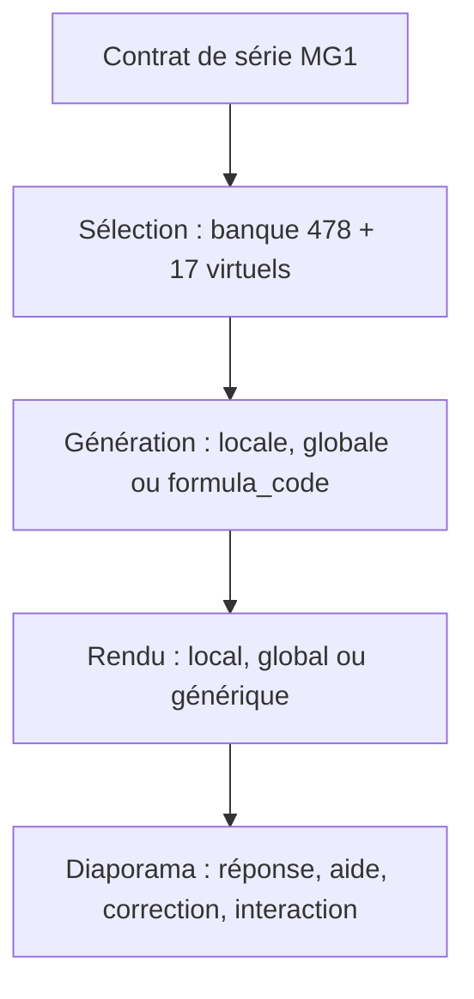

# Inventaire de reconstruction — Automatismes maths&go

## Verdict

Ce travail est utile et nécessaire avant de poursuivre le découpage. La bêta n’est pas encore constituée de 43 outils totalement autonomes : les données sont bien séparées par module, mais une partie importante de la génération, du tirage, du rendu, des réponses, des aides et des corrections demeure dans des moteurs globaux.

La source à reproduire doit être la bêta actuelle. L’ancien fichier HTML monolithique ne doit servir qu’à contrôler les comportements historiques et les dépendances cachées.

## Source examinée et niveau de confiance

- Dépôt canonique : `bourgault314/mathsgo-automatismes-beta`.
- Commit examiné : `242c81f636e3b443af028b1fef7cd68fb9db1356` du 17 juillet 2026.
- Banque protégée par les tests : 43 modules et 478 gabarits, empreinte SHA-256 `e239967f763f1c44d01161f542a84c71181b48fc330c13ac6f84ebb8cba10e45`.
- Vérification effectuée : toute la suite `npm test` passe, y compris banque, documentation, visuels, pédagogie, manipulations et lancement.
- Ancien témoin contrôlé : `maths/auto/index1.html`, commit `695f5d704681d6d0a4bf8af632cbfd356f933ce7`, blob `55401a3f88b5f937a5944ee62e37724f0a8e5a5b`.

Le fichier JSON joint descend jusqu’à chaque gabarit : numéro, aperçu et empreinte de l’énoncé, réponse, options, code aléatoire, placeholders, politique visuelle, composant, aide, moteur réellement utilisé et dépendances globales.

## Ce que l’inventaire révèle

| Élément | Résultat |
|---|---:|
| Modules | 43 |
| Gabarits présents dans les banques | 478 |
| Gabarits virtuels créés par les sélecteurs | 17 |
| Définitions exécutables à préserver | 495 |
| Composants visuels enregistrés | 27 |
| Contrats de manipulation | 10, dont 9 actifs et 1 planifié |
| Questions contenant encore un SVG en ligne | 146 |
| Questions déclarant un rôle visuel sans identifiant de composant réutilisable | 184 |
| Questions possédant encore un `formula_code` | 271 |
| `formula_code` réellement exécutés par le moteur générique | 173 |
| `formula_code` conservés mais court-circuités par un générateur spécialisé | 98 |
| Gabarits virtuels sans classement pédagogique | 13 |

Les 184 questions sans identifiant de composant ne sont pas nécessairement cassées : leur figure peut encore être embarquée dans l’énoncé ou produite par le gros moteur. Ce nombre mesure le travail d’extraction restant, pas 184 absences d’affichage.

### Les 17 gabarits virtuels

Ils n’apparaissent pas dans les 478 objets de banque. Ils sont construits par les fichiers `selection.js`, puis pris en charge par les pilotes fonctionnels.

| Module | Gabarits virtuels | Classement pédagogique |
|---|---|---|
| `dnb_14` | Q19 placer un point, Q20 déterminer le pas, Q21 choisir la bonne droite | complet |
| `dnb_15` | Q10 placer un point, Q11 placer deux points, Q12 vrai/faux sur les coordonnées | absent pour les 3 |
| `dnb_17` | Q11 à Q20 : nature, nommage, ouverture, erreur de longueur, opposés, bissectrice, parallélisme, équerre, choix de figure, rapporteur | absent pour les 10 |
| `dnb_18` | Q11 placer les angles puis calculer `x` | complet |

La banque et les tests pédagogiques donnent donc une image partielle : les 478 gabarits de banque sont classés, mais 13 des 17 gabarits ajoutés à l’exécution ne le sont pas encore. C’est la première lacune à fermer dans la fondation.

## La bibliothèque visuelle commencée par Claude

La page `auto/dev/visual-library.html` est utile. Elle charge les 43 registres pédagogiques, les 10 contrats de manipulation et les 27 composants visuels, puis rend leurs préréglages et leurs états question/correction. Elle permet donc de valider un composant isolé sur téléphone, ordinateur, projection et impression.

Elle n’est cependant ni la banque complète ni le moteur des automatismes :

- elle ne montre pas les 478 énoncés et leurs variantes aléatoires ;
- elle n’exécute pas l’équilibrage des séries ;
- elle ne révèle pas à elle seule les gabarits virtuels des sélecteurs ;
- elle ne montre pas toutes les dépendances encore logées dans `02-question-engine.js`, `03-slideshow.js` et `04-app.js` ;
- elle ne doit pas devenir un deuxième Studio ou une deuxième source de vérité.

Conclusion : il faut la conserver et l’enrichir comme banc d’essai des composants. Elle complète cet inventaire, elle ne le remplace pas.

## Chaîne réelle à reconstruire

Les données d’un module ne suffisent donc pas. Pour déclarer un outil réellement reconstructible, il faut préserver ensemble :

1. son identité stable et ses niveaux ;
2. ses gabarits de banque et ses éventuels gabarits virtuels ;
3. ses règles de tirage et de couverture ;
4. sa génération déterministe ;
5. son rendu question/correction avec et sans aide ;
6. son type de réponse et ses valeurs acceptées ;
7. son cours et les sections d’aide pertinentes ;
8. son état de manipulation, sa remise à zéro et sa sérialisation ;
9. ses variantes téléphone, ordinateur, projection et impression.

## Hasard, séries et répétitions

- La seed est comprise entre 0 et 233279.
- `setSeed` initialise un générateur pseudo-aléatoire déterministe ; `rnd`, `RD` et `pick` alimentent ensuite tous les tirages.
- Une même définition MG1 contient niveau, nombre de questions, modules, seed, mode d’aide et expérience.
- Les quantités admises sont 5, 10, 15 ou 20 questions.
- Le mode interactif produit 10 séries successives à partir d’une seule seed et d’une seule banque de tirage continue.
- Un gabarit ne revient pas avant l’épuisement de son paquet, sauf contrainte propre au module.
- Les places supplémentaires sont données aux modules les moins servis d’une série à l’autre.
- L’ordre final entrelace les modules pour éviter les longues répétitions.
- Six familles possèdent encore un sélecteur spécial dans le moteur global : fractions ×/÷, fractions–pourcentages, solides, aires et les deux trigonométries.

Ce fonctionnement doit devenir un contrat indépendant de l’écran. Il ne faut pas disperser un second `Math.random()` dans les futurs composants.

## Réponses et corrections

Répartition des 478 gabarits de banque selon le registre pédagogique :

| Réponse | Questions |
|---|---:|
| Numérique | 285 |
| QCM à une réponse | 149 |
| Expression algébrique | 15 |
| QCM à réponses multiples | 12 |
| Constructeur Pythagore | 5 |
| Manipulation | 4 |
| Jetons relatifs | 4 |
| Placement de point | 3 |
| QCM variable | 1 |

Le diaporama transforme ensuite ces réponses en QCM, nombre, fraction, plusieurs champs, expression algébrique, coordonnées ou glisser-déposer. Une faiblesse reste visible dans le contrat persistant : les options de QCM ont encore `errorCode: null`, même lorsque certains générateurs savent produire des distracteurs diagnostiques. Avant l’intégration dans un suivi élève, il faut décider où ces codes d’erreur deviennent canoniques.

## Cartographie des 43 modules

Légende :

- **local** : le pilote du module traite tous les gabarits de banque concernés ;
- **hybride** : une partie passe par le pilote local, l’autre retombe dans le moteur global ou générique ;
- **moteur global** : comportement spécial encore présent dans `02-question-engine.js` ou `04-app.js` ;
- **formule/générique** : substitution de `formula_code`, puis rendu générique ;
- **sans composant** : nombre de questions ayant une politique visuelle non nulle mais aucun identifiant de composant réutilisable.

| Module | Notion | Banque | Génération | Sélection | Rendu | Sans composant | Manipulations |
|---|---|---:|---|---|---|---:|---|
| `dnb_01` | Écriture décimale des fractions simples | 16 | moteur global | paquet global | moteur global | 0 |  |
| `dnb_02` | Comparer et calculer avec des nombres décimaux | 10 | local | locale | local | 0 | cartes, encadrement, distributivité |
| `dnb_02b` | Multiplier et diviser par 10, 100 et 1 000 | 12 | local | locale | local | 0 | glisse-nombre |
| `dnb_03` | Fractions : simplifier, comparer, additionner | 7 | moteur global | paquet global | moteur global | 0 |  |
| `dnb_03b` | Fractions : multiplier et diviser | 6 | moteur global | globale spéciale | moteur global | 0 |  |
| `dnb_04` | Fractions d’une quantité et pourcentages repères | 11 | moteur global | globale spéciale | moteur global | 0 |  |
| `dnb_05` | Un même nombre sous plusieurs formes | 10 | moteur global | paquet global | moteur global | 0 |  |
| `dnb_06` | Notation scientifique | 11 | formule/générique | paquet global | moteur global | 0 |  |
| `dnb_07` | Carrés des entiers de 1 à 12 | 10 | formule/générique | paquet global | moteur global | 0 |  |
| `dnb_08` | Critères de divisibilité | 10 | local | locale | local | 0 |  |
| `dnb_09` | Double, triple, moitié, voisins et carré | 18 | moteur global | paquet global | moteur global | 0 |  |
| `dnb_10` | Simplifier des expressions littérales | 6 | moteur global | paquet global | moteur global | 0 |  |
| `dnb_11` | Valeur d’une expression algébrique | 11 | moteur global | paquet global | moteur global | 0 |  |
| `dnb_12` | Développer et factoriser | 10 | formule/générique | paquet global | générique | 0 |  |
| `dnb_13` | Résoudre des équations | 12 | moteur global | paquet global | moteur global | 0 |  |
| `dnb_14` | Lire une abscisse | 18 + 3 virtuels | hybride | locale | hybride | 0 | point sur droite |
| `dnb_38` | Addition de relatifs entiers | 8 | moteur global | paquet global | moteur global | 0 | jetons relatifs |
| `dnb_39` | Décimaux relatifs | 3 | local | locale | local | 0 |  |
| `dnb_15` | Lire des coordonnées | 9 + 3 virtuels | hybride | locale | hybride | 0 | placement de points |
| `dnb_16` | Codage de figures | 10 | formule/générique | paquet global | générique | 10 |  |
| `dnb_17` | Angles : reconnaître, nommer et mesurer | 10 + 10 virtuels | hybride | locale | local | 0 |  |
| `dnb_18` | Somme des angles d’un triangle | 10 + 1 virtuel | hybride | locale | hybride | 0 | constructeur d’angles |
| `dnb_19` | Conversions d’unités | 10 | moteur global | paquet global | moteur global | 1 |  |
| `dnb_20` | Reconnaître des solides | 35 | moteur global | globale spéciale | moteur global | 35 |  |
| `dnb_21` | Périmètres | 12 | formule/générique | paquet global | moteur global | 12 |  |
| `dnb_22` | Aires | 18 | moteur global | globale spéciale | moteur global | 16 |  |
| `dnb_23` | Volumes | 10 | formule/générique | paquet global | moteur global | 10 |  |
| `dnb_24` | Pythagore | 10 | formule/générique | paquet global | moteur global | 2 |  |
| `dnb_24b` | Pythagore tactile | 5 | moteur global | paquet global | moteur global | 0 | constructeur Pythagore |
| `dnb_25` | Thalès | 10 | formule/générique | paquet global | moteur global | 0 |  |
| `dnb_26` | Trigonométrie sans calculatrice | 12 | moteur global | globale spéciale | générique | 10 |  |
| `dnb_26b` | Trigonométrie avec calculatrice | 12 | moteur global | globale spéciale | générique | 12 |  |
| `dnb_27` | Symétries et translation | 13 | formule/générique | paquet global | générique | 12 |  |
| `dnb_28` | Probabilités | 10 | formule/générique | paquet global | générique | 0 |  |
| `dnb_29` | Fréquences | 10 | formule/générique | paquet global | générique | 0 |  |
| `dnb_30` | Moyennes | 10 | moteur global | paquet global | moteur global | 9 |  |
| `dnb_31` | Médiane et étendue | 12 | formule/générique | paquet global | générique | 0 |  |
| `dnb_32` | Tableaux, diagrammes et graphiques | 10 | formule/générique | paquet global | local | 10 |  |
| `dnb_33` | Reconnaître une proportionnalité | 10 | formule/générique | paquet global | générique | 5 |  |
| `dnb_34` | Problèmes de proportionnalité | 11 | formule/générique | paquet global | moteur global | 10 |  |
| `dnb_35` | Évolutions en pourcentage | 10 | moteur global | paquet global | moteur global | 10 |  |
| `dnb_36` | Lire un graphique de dépendance | 10 | formule/générique | paquet global | générique | 10 |  |
| `dnb_37` | Interpréter une suite d’instructions | 10 | formule/générique | paquet global | générique | 10 | blocs planifiés |

## Contrôle avec l’ancien HTML

L’ancien monolithe contrôlé contient 37 modules et 369 questions de banque. Les 37 identifiants de modules existent toujours dans la bêta. La bêta ajoute six modules : `dnb_02b`, `dnb_03b`, `dnb_24b`, `dnb_26b`, `dnb_38` et `dnb_39`.

Sur les identifiants historiques, 363 questions ont encore le même couple module/numéro. Six anciens numéros ont été retirés ou remplacés : `dnb_02.q2`, `dnb_02.q5`, `dnb_03.q8`, `dnb_03.q9`, `dnb_03.q10` et `dnb_09.q7`. La bêta possède 115 identifiants de questions de banque qui n’existaient pas dans ce témoin.

Le contenu a aussi évolué après le monolithe. Celui-ci reste utile pour retrouver un ancien SVG, une formulation ou une dépendance, mais il serait dangereux de le recopier comme vérité actuelle.

## Ordre de travail recommandé

### 1. Stabiliser la fondation

Avant d’intégrer l’univers graphique ou de déplacer tous les objets à l’écran, formaliser un contrat unique capable de représenter : banque, gabarits virtuels, génération, sélection, rendu, réponse, aide, correction, manipulation et supports.

Les validateurs doivent figer au minimum :

- 43 modules ;
- 478 gabarits de banque ;
- 17 gabarits virtuels ;
- 495 définitions exécutables ;
- identité MG1 et seed ;
- sorties déterministes sur plusieurs seeds ;
- parité question/correction et avec/sans aide.

### 2. Fermer les incohérences de description

- Classer les 13 gabarits virtuels de `dnb_15` et `dnb_17`.
- Mettre à jour les documents qui annoncent encore 42 modules, 475 gabarits ou 476 gabarits.
- Distinguer dans les documents « gabarit de banque » et « gabarit virtuel d’exécution ».
- Décider du contrat canonique des codes d’erreur des distracteurs.

### 3. Valider le contrat sur des tranches verticales

- `dnb_08` : pilote simple, entièrement local, sans manipulation complexe.
- `dnb_02` ou `dnb_02b` : génération, sélection, rendu, diagnostic et manipulation.
- `dnb_14` ou `dnb_18` : cas hybride avec gabarits virtuels.

Un module n’est déclaré extrait que lorsque la génération, le tirage, le rendu, la réponse, le cours, la correction et les supports ont tous quitté les gros moteurs ou sont appelés par un contrat explicite.

### 4. Extraire le reste par familles

Priorité aux modules ayant un générateur et un rendu globaux, puis aux 184 questions dont le visuel n’a pas encore d’identifiant de composant. L’extraction doit rester structurelle : déplacer le comportement sans le redessiner ni changer les valeurs tirées.

### 5. Placer les objets et intégrer l’univers

La décision téléphone/ordinateur ne doit pas être repoussée à la toute fin, mais elle ne doit pas non plus précéder les contrats sémantiques.

- Maintenant : définir l’état, les actions et les supports de chaque objet.
- Pendant l’extraction de chaque composant : tester son placement sur téléphone, ordinateur et projection.
- Après deux ou trois tranches verticales stabilisées : intégrer le shell et l’univers graphique commun.
- À la fin : harmoniser les écrans, sans modifier les contrats pédagogiques déjà validés.

Autrement dit : continuer à construire la base, oui, mais une base verticale et testable. L’univers vient se brancher dessus ; il ne doit pas devenir l’endroit où la logique des questions est cachée.

## Fichier machine

`inventaire-automatismes-beta.json` est la version exploitable par Claude ou par un script. Il contient les 43 modules, les 478 gabarits de banque, les 17 virtuels, les composants, les manipulations, les politiques visuelles, les aides, les sélecteurs et les dépendances globales.
